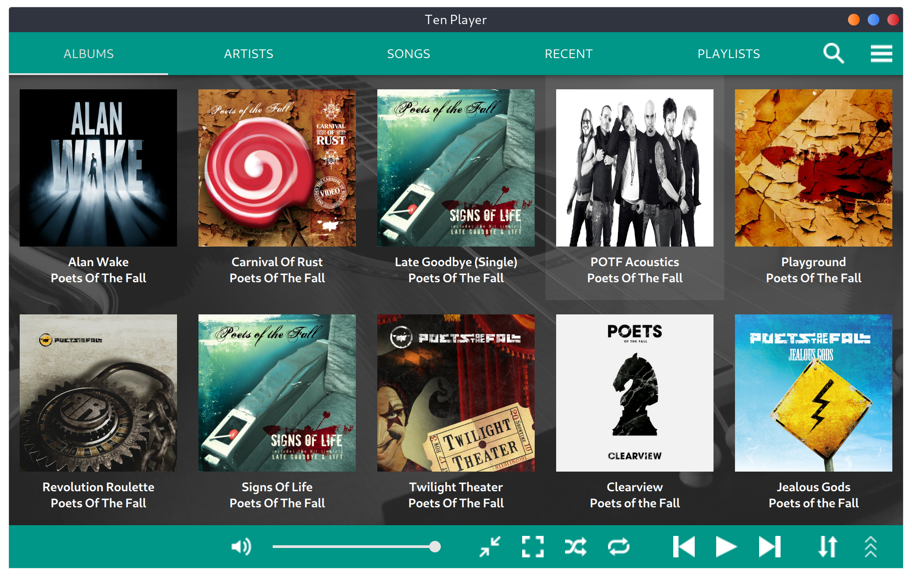
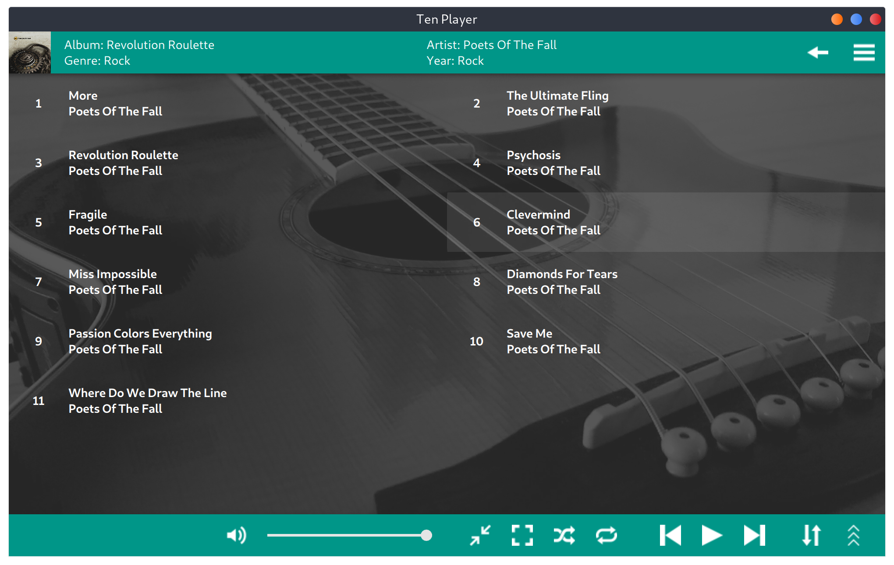
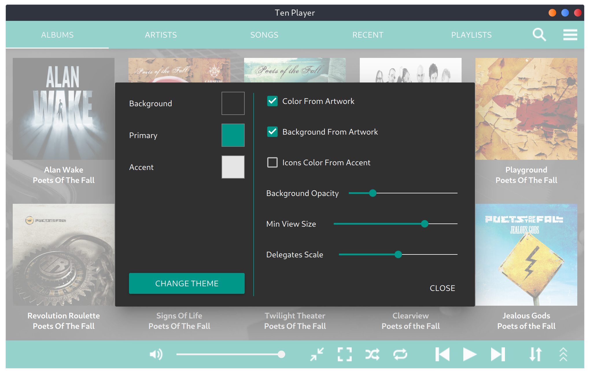

# TenPlayer
TenPlayer is a music player with material user interface written for Linux OS using C++ and Qt framework.

# Note
This project is incomplete and I don't have the time to work on it myself. If anyone is interested in completing it you can open on issue about the part you want to work on so we can discuss it further.

# Building from Source
If you are using qtcreator you can just load the project inside qtcreator and run the project from there. If you are not using qtcreator make sure you have qt and qmake installed on your system and run the commands below inside the project directory:

``` shell
$ qmake TenPlayer.pro
$ make
```

# License
This project is published under GPL v3.0 license. See the [license file](LICENSE) for more details.

# Screenshots



